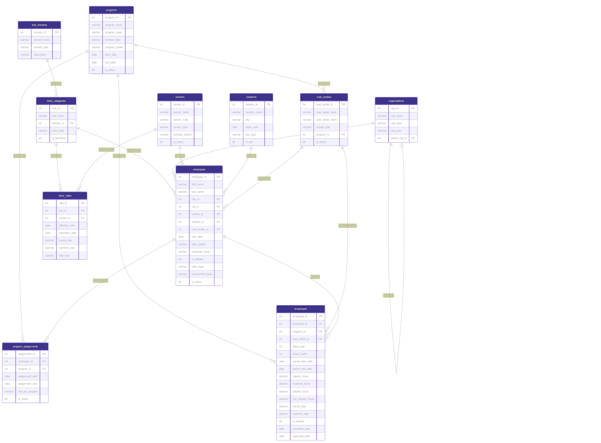

# Design Document

By Seanpaul Coffey

Video overview: [YOUR YOUTUBE URL HERE]

## Scope

Managing the fine line between spending the taxpayer's dollars while simultaneously ensuring that the government gets a deliverable that meets requirements, this is a very thin, complex line that a Contracting Officer, Team Chief, and Director have to focus on. Regardless of whether there is a cost overrun on a program or if a program is understaffed and behind schedule, the first question is always going to be "why?" Drilling down into the data and understanding what is driving a program to succeed, meet schedule, or even fail is integral.

This database is designed to give broad areas of interest where insights could be pulled from. There are eleven tables involved in the scope of this schema, which consists of skill domains, programs, labor categories, labor rates, program assignments, employees, vendors, locations, cost centers, organizations, and timesheets. One strong understanding before reviewing this schema is that there is no proprietary information. All data has been randomly generated to ensure that this schema is pure fiction. Explicitly out of scope are overhead, fringe, general & administrative, and facility capital cost of money, program details, payroll system information, and PII beyond name, which has been purposely unexplored to maintain separation.

Within this schema, various sorts of analysts can work to develop a variety of different insights—from financial cost breakdowns to workforce distribution analysis to program staffing trends. The schema is broad enough that multiple roles could interact with it and each walk away with a different experience.

## Functional Requirements

This database should support a range of analytical and operations workflows across multiple roles. Budget and Cost Analysts can focus purely on the financial costs of the programs, perhaps gain extra insight into seniority, or find individual labor cost breakdowns. They should be able to compare vendor rates side-by-side for the same labor category and track how rates escalate over time. They will usually export the data to Excel to then put together data visualizations for quarterly, semi-annual, and annual reporting. Project and Program Managers focused on earned value management (EVM) can run variance analysis on timelines and pull previous cost estimates to determine predicted versus actuals. They should also be able to see who is assigned to their program, in what role, and from which vendor. They will typically not have as robust experience with SQL; therefore, it is imperative that the data in the database remains clean and views are checked. Data Analysts will be leaned on heavily for the non-financials to query a variety of insights for senior leadership. They may determine number of clearances in the field and compare with remaining clearances allotted for the workforce. They may run insights on programs when labor categories shift, visualize escalation of rates YoY (if financial teams haven't already), look into factors breaking down a growing or shrinking workforce, or even look at shifting skill domains. They may then follow up by using Tableau or Excel for data visualization. Data scientists may be more interested in developing processes and procedures to improve the database, or perhaps run tests while integrating machine learning processes to automate certain tasks. It isn't unlikely that they could be involved in the front end—working to clean up data before it gets imported.

Beyond these roles, the database should support common operations transactions: onboarding a new employee, submitting and approving timesheets, recording new vendor labor rates, and updating a program's lifecycle phase as it moves from active to close-out to completed.

What this database does not support is the actual processing of payroll, the administration of employee benefits, the storage of contract award documents, or invoice-level financial reconciliation. Those systems would work adjacent to this in a production environment.

## Representation

### Entities
Before walking through each table, a few design conventions apply across the entire schema. Every primary key uses INT with IDENTITY(1,1) so that each new entry gets auto-incremented by one, reducing human error. NVARCHAR has been strategically chosen over VARCHAR in case there is any Unicode used for name fields or descriptions. BIT is used frequently for columns like is_active and is_billable to track things that should be a "yes" or a "no." DECIMAL(6,2) is used for hour fields to allow fractional hours with precision to two decimal places, while DECIMAL(10,2) is used for monetary fields to ensure cent-level accuracy. DATE is used over DATETIME to reduce any additional space needed since day-level granularity is sufficient for workforce tracking. CHECK constraints have been applied to columns with known, predictable values that will not vary, such as clearance levels being limited to 'None', 'Secret', 'TS', or 'TS/SCI'.

The first table, skill_domains, captures the broad area of expertise that a specific labor category may fall under. The primary key is domain_id. Domain_name is required and unique since no two skill domains should share a name. The domain_type column is constrained to 'Technical', 'Functional', or 'Management'. There are more domain types in practice, but for the purposes of this schema, these three cover the vast majority of what you'd see in a defense workforce.

The second table, organizations, establishes the hierarchical structure of the organization from directorate down to branch. It is arguably the most unique table in the schema as it is the only one that references itself. The parent_org_id column points back to org_id in the same table, which is why the foreign key had to be added through an ALTER TABLE statement after the table was created. This self-referencing design is what makes it possible to run a recursive CTE later on to walk up or down the org tree.

The third table, vendors, represents the contractor companies providing labor. This is the first table using a BIT column since we either know that a vendor is active or it is not. The default is set to 1 because more often than not, if a vendor is being entered into the system, it is because they are actively performing work. Two things to note about the constraints: vendor_code uses UNIQUE because no two vendors would ever share the same code, and vendor_type is constrained to a known set of small business designations since these categories are legally defined and do not change.

The fourth table, programs, represents the contract programs that consume labor and generate cost. The program_id is the primary key. DATE is used for start_date and end_date since that is the most granular distinction that needs to be made for program periods of performance. Five constraints are applied: the primary key, a unique program_code, contract_type which is predictable per the Federal Acquisition Regulations, program_phase which covers the full lifecycle for this schema's purposes, and a date validation ensuring that no end date can be inserted before the start date since that would not logically make sense.

The fifth table, locations, tracks where employees physically work. The notable design choice here is the is_scif column which defaults to 0. This default exists because SCIF status should not be assumed. You cannot logically assume that a contractor site has a SCIF. Sometimes contractors do not own one and may need to go out and secure a lease, workstation licenses, or a co-use agreement before one is operational.

The sixth table, labor_categories, defines specific labor roles such as Systems Engineer III or Cyber Analyst II. Each labor category maps to a parent skill domain through the domain_id foreign key. The is_technical flag allows filtering between technical and functional roles, which is a common distinction in workforce mix analysis. The labor_type column is constrained to a known set of values representing how labor is classified.

The seventh table, cost_centers, represents the charge codes tied to specific programs. This is where labor hours and costs get recorded in the system. Each cost center maps to exactly one program through the program_id foreign key. The charge_type column distinguishes between Direct, Indirect, Overhead, G&A, B&P, and IR&D, which are standard cost allocation categories in defense contracting.

The eighth table, employees, is where most stakeholders will overlap when running analysis. It serves as the central fact table for the schema, connecting to labor_categories, organizations, vendors, locations, and cost_centers through five foreign keys. The clearance_level, labor_type, and employment_type columns all use CHECK constraints since these values are known and predictable. Even with this level of detail, one could greatly expand this table in a production environment to include indirect rate data, additional HR attributes, or performance metrics for deeper analysis.

The ninth table, program_assignments, resolves the many-to-many relationship between employees and programs. A single employee can be assigned to multiple programs simultaneously, and a single program can have many employees. Each assignment tracks the employee's role on the program, the start and end dates, and whether the assignment is currently active. The date constraint ensures that no assignment end date can come before the start date.

The tenth table, labor_rates, captures vendor-specific billing rates by labor category. Each rate record has an effective date and an optional expiration date, which allows the database to maintain a history of rate changes over time. The rate_type column distinguishes between Base, Escalated, Ceiling, Proposed, and Negotiated rates. This is critical for procurement analysts who need to compare what a vendor proposed against what was ultimately negotiated. The overtime rate has a constraint ensuring it cannot be lower than the standard hourly rate.

The eleventh table, timesheets, is the primary transactional table and the source for most financial and utilization reporting. Each record captures a single employee's hours against a specific program and cost center for a given fiscal period. Regular hours, overtime hours, billable hours, and non-billable hours are all tracked separately to support different analytical cuts. The hourly_rate and overtime_rate fields store the rate applied at the time of the timesheet entry. A constraint ensures that a timesheet cannot have an approved_date unless it has already been submitted, enforcing the real-world workflow where submission must precede approval.

### Relationships
The relationships have been strategically correlated to ensure that any person familiar with government data would be able to make proper connections without asking "why?" The skill domains table has been connected to labor_categories in a one-to-many relationship since each labor category falls under only one skill discipline. If someone saw a "systems engineer" they wouldn't think "that job is a manager and a technical job." Although there is occasional nuance, dual-hatting a job is a relatively seldom-thought-of concept since contractors have to adhere to proposed labor rates.

Labor_categories has a one-to-many relationship with employees that follows a similar logic. Since contractors are billed hourly, you would not inherently risk dual-hatting an employee since there are staffing clauses that contractors have to adhere to.

Labor_categories also connects to labor_rates in a one-to-many relationship. A single labor category like "Systems Engineer III" can have multiple rates across different vendors and rate types. This is fundamental to how cost analysis works in procurement. You need to see what Arctic Fox Systems charges for a Systems Engineer III versus what Silver Otter Analytics proposed for the same role.

Organizations connect to employees in a one-to-many relationship since each employee belongs to exactly one org. But the more interesting relationship is the self-referencing one within organizations itself. The parent_org_id column points back to org_id in the same table, creating the directorate-to-division-to-branch hierarchy. This is what allows a recursive CTE to walk the entire org tree from the top down or the bottom up.

Vendors connect to both employees and labor_rates in one-to-many relationships. One vendor employs many people and one vendor has many rates across different labor categories. These two paths converging on the same vendor is what makes side-by-side vendor comparison queries possible.

Programs connect outward to three tables. It connects to cost_centers (one-to-many) since a single program can have multiple charge codes for direct labor, overhead, G&A, and other cost pools. It connects to program_assignments (one-to-many), which is how employees get mapped to programs. And it connects to timesheets (one-to-many) since all hours charged to a program flow through this relationship.

The program_assignments table also proves to be noteworthy as it resolves the many-to-many relationship between employees and programs. One employee can be assigned to multiple programs simultaneously and one program can have dozens of employees. An individual could be on a bench providing surge support when needed, or could perhaps be a Systems Engineering Technical Advisor (SETA) to multiple programs. This junction proves crucial to cleanly represent this relationship.

Locations connect to employees in a one-to-many relationship. Each employee works at one location, but a single location can house many employees. This is straightforward but supports workforce distribution analysis by site.

Cost_centers connect to both employees and timesheets in one-to-many relationships. Employees charge to a cost center, and timesheets record hours under a cost center. This makes cost_centers the financial backbone of the schema since both headcount and hours flow through it.

Timesheets sit at the intersection of employees, programs, and cost_centers. It is the most relationship-heavy transactional table in the schema. Every timesheet row references who worked (employee_id), what they worked on (program_id), and where the cost was recorded (cost_center_id). This three-way intersection is what makes burn rate analysis, utilization reporting, and program cost tracking all possible from the same underlying data.

## Optimizations

With a schema that spans eleven tables and is intended for workforce and cost analysis, optimization had to be considered early. The first major optimization was indexing every foreign key column. SQL Server does not automatically index foreign keys, and without those indexes, joins across employees, programs, vendors, labor categories, cost centers, and timesheets would become increasingly inefficient as the data grows. Since this schema is built to support analytical querying, those joins are going to happen constantly. Indexing the foreign keys helps reduce unnecessary scans and keeps the relational structure performant.

Beyond that, additional nonclustered indexes were added on columns that would realistically be used most often in filtering. Fields such as is_active, is_billable, fiscal_year, fiscal_month, effective_date, and program_phase are all natural candidates for WHERE clause filtering in workforce analytics. A cost analyst may want only active vendors, a program manager may want a specific fiscal period, and a workforce planner may want only current assignments. These indexes support those use cases directly.

The schema also uses views as an optimization strategy. Rather than requiring every user to repeatedly write the same complex joins, four views were created to pre-assemble common analytical outputs: a denormalized workforce roster, a program burn-rate summary, a vendor rate comparison view, and a skill domain coverage view. In a defense workforce context, this consistency matters because different teams pulling the same insight need to reach the same conclusion. A Cost Analyst and a Program Manager should not be getting different burn rate numbers because they wrote slightly different ad hoc queries.

## Limitations

Although this schema is broad enough to support meaningful workforce and cost analysis, it still has limitations. One of the biggest is that employee movement between vendors is not historically tracked in a clean way. The current design reflects a point-in-time vendor association rather than preserving a full history of vendor changes across a program lifecycle. Similarly, labor rate escalation is handled by inserting new records into labor_rates rather than versioning changes within a single row, which means queries asking for the applicable rate on a specific date require additional date-range filtering.

The organizational hierarchy also has limitations. While the self-referencing structure works well for a directorate-to-division-to-branch hierarchy, it is a simpler model than what some real organizations require. A closure table or nested set model would handle arbitrary depths and cross-organizational relationships more cleanly than the current self-referencing design.

There is also no audit trail built into the schema. It does not track when a row was created, last updated, or by whom. In addition, timesheet data is stored at the monthly level rather than weekly or daily granularity, which limits more detailed utilization analysis. The schema also has no concept of a program budget or ceiling. It tracks what was spent through timesheets but has no mechanism to compare actual costs against an authorized amount. For a tool intended to support cost analysis, that is a meaningful gap. Lastly, the schema assumes one primary cost center association per employee at a time, while in practice an individual may split charge across multiple cost centers within the same reporting period.

